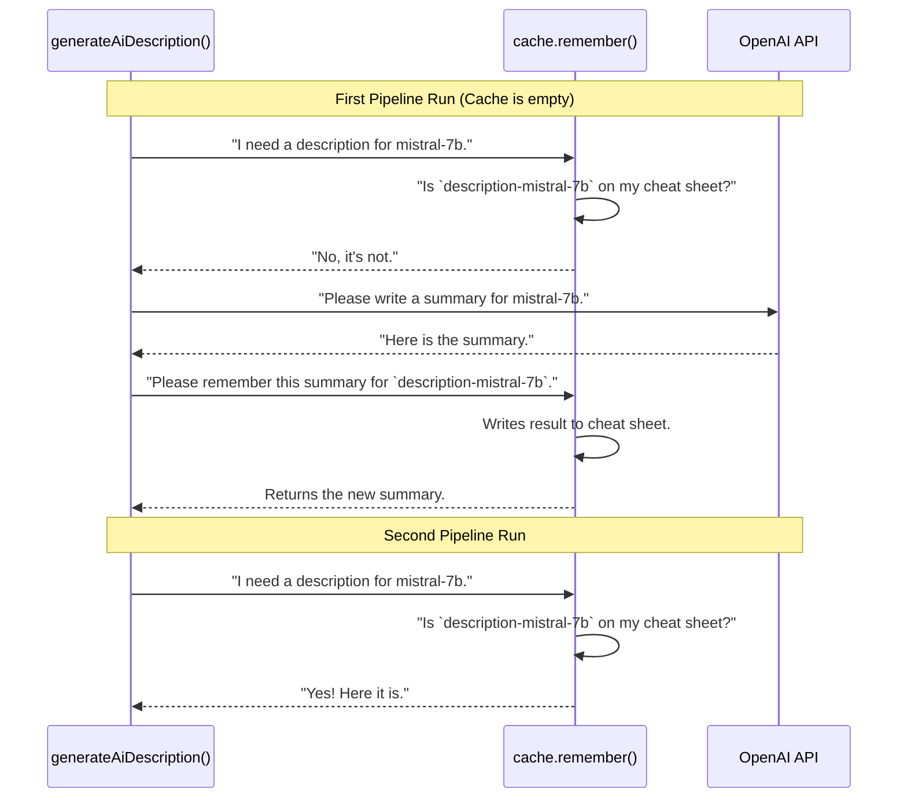

# Chapter 5: Application Caching

In the [previous chapter](internal-vs-api-data-models-1708060760.md), we learned how we create a clean and stable `models.json` file from our more complex internal data structures. Our pipeline is complete! It can fetch data, enrich it with descriptions and pricing, and save it in a a final, documented format.

However, there's a problem. Some of our processing steps are slow and can be expensive. For example, to generate a missing model description, we ask a powerful AI like GPT-4. To get pricing in different currencies, we call a currency conversion API. If we run our pipeline twice in the same day, do we really need to ask the AI to write the *exact same description* again? And will the currency rate have changed that much?

This is wasteful. It costs us time and money (for API usage). We need a way to remember the results of these expensive operations. This is where **Application Caching** comes in.

### The "Cheat Sheet" Analogy

Imagine you're solving a list of very hard math problems. The first time you solve problem #5, it takes you 10 minutes. You write the answer on a "cheat sheet" next to the problem number.

Later, you're given the same list of problems again. When you get to problem #5, you don't need to solve it all over again. You just look at your cheat sheet, find the answer for #5, and write it down. It takes 5 seconds instead of 10 minutes.

Our `AppCache` is exactly this: a digital cheat sheet. It's a simple system that remembers the results of slow or expensive tasks.

-   **The expensive task:** Calling an AI to generate a description for the "Llama 3" model.
-   **The "cheat sheet" key:** A unique name for this task, like `"description-llama-3"`.
-   **The result:** The AI-generated description.

The next time our pipeline needs a description for "Llama 3," it first checks the cache. If it finds the result, it uses it instantly, saving us an API call.

### How We Use the Cache: The `remember` Function

The core of our caching system is a single, powerful function: `remember`. Every processing step that performs a slow or costly operation gets access to the cache.

Let's look at a simplified example from our `generateAiDescription` function, which asks an AI to write a model summary.

```typescript
// .github/.generate/src/processing/steps/generateDescription.ts

async function generateAiDescription(model, cache, options) {
  // Define a unique key for this model's description.
  const cacheKey = `description-${model.id}`;

  // Ask the cache to remember the result of this operation.
  return cache.remember(cacheKey, async () => {
    // THIS CODE ONLY RUNS IF THE ANSWER IS NOT IN THE CACHE!
    console.log(`Generating a new summary for ${model.id}...`);
    return await askAiForSummary(model, options.secrets.openAiKey);
  });
}
```

This is how to read `cache.remember(key, work_function)`:

1.  **`key` (`cacheKey`):** This is the name of the thing we want to remember (e.g., `"description-llama-3"`). It's how we'll look it up later.
2.  **`work_function` (`async () => { ... }`):** This is the expensive work itself. This function will **only be called if the answer is not already on our cheat sheet.**

The magic is that our code doesn't need to know whether the result came from the cache or from running the expensive task. It just calls `remember` and gets the correct answer back every time.

### Caching in Action: A Step-by-Step Walkthrough

Let's see what happens on the first and second runs of our pipeline for a model called `mistral-7b`.



-   **First Run (Cache Miss):** The cache doesn't have an entry for `description-mistral-7b`. So, the `remember` function executes the "work function" we gave it, which calls the OpenAI API. Once the API returns a summary, `remember` saves it to our cache file and then returns the summary to the step.
-   **Second Run (Cache Hit):** The cache *does* have an entry for `description-mistral-7b`. The "work function" is **completely skipped**. The `remember` function immediately reads the summary from the cache file and returns it. The expensive API call is avoided!

### Under the Hood: A Simple JSON File

So where is this "cheat sheet" stored? It's just a file on disk! Our `AppCache` is a simple layer on top of a JSON file, usually named `.cache.json`.

When the `createCache` function is called at the start of the pipeline, it reads this file into memory.

```typescript
// .github/.generate/src/processing/AppCache.ts

// The cache is just a big JavaScript object.
// The keys are the "cheat sheet" keys, and the values are the saved results.
// { "description-mistral-7b": "A small but powerful model...", ... }
const storage: Record<string, any> = JSON.parse(
  fs.readFileSync(cacheFileName, 'utf-8')
);
```

The `remember` function then works with this `storage` object.

```typescript
// .github/.generate/src/processing/AppCache.ts (Simplified)

async remember(key: string, value: () => Promise<any>): Promise<any> {
    // 1. Is the key already in our storage object?
    if (storage[key]) {
      // If yes, return the stored value immediately.
      return storage[key];
    }

    // 2. If not, run the expensive work function to get the result.
    const result = await value();

    // 3. Store the new result in our object.
    storage[key] = result;
    // And save the updated object back to the JSON file.
    fs.writeFileSync(cacheFileName, JSON.stringify(storage), 'utf-8');

    // 4. Return the new result.
    return result;
}
```

As you can see, the logic is very simple: **Check -> If not found, Work -> Save -> Return**. This simple pattern is what makes our pipeline fast and efficient.

### Caching More Than Just Descriptions

This powerful tool is used in several places to optimize our pipeline:
-   **Currency Conversion:** We cache currency exchange rates for the day. We don't need to ask the API for the USD-to-EUR rate a hundred times. (See `convertCurrency.ts`)
-   **Description Translations:** After translating a description to German with the DeepL API, we cache the result. (See `generateDescriptionTranslations.ts`)
-   **Fetching Hugging Face files:** We cache the content of model README files to avoid re-downloading them. (See `generateDescription.ts`)

Any operation that is slow, expensive, and gives the same output for the same input is a perfect candidate for caching.

### Conclusion

You've now learned about the final piece of our optimization puzzle: **Application Caching**. This simple but effective system makes our entire data processing pipeline dramatically faster and more cost-effective.

Here are the key takeaways:
-   **Caching saves time and money** by "remembering" the results of expensive operations like API calls.
-   The core of our system is the `cache.remember(key, work_function)` pattern.
-   It works like a "cheat sheet," checking for a result before doing the hard work.
-   Under the hood, it's just a simple **JSON file** that stores key-value pairs.

Congratulations! You've journeyed through the entire `HAWKI - Model Repository` backend. From the high-level [Data Processing Pipeline](data-processing-pipeline-1338362951.md) to the specific [Model Data Sources](model-data-sources-1211143.md), through the powerful [Pluggable Processing Steps](pluggable-processing-steps-1541383417.md), and finally to our optimization with caching. You now have a complete picture of how we automatically collect, enrich, and deliver high-quality data about AI models.

