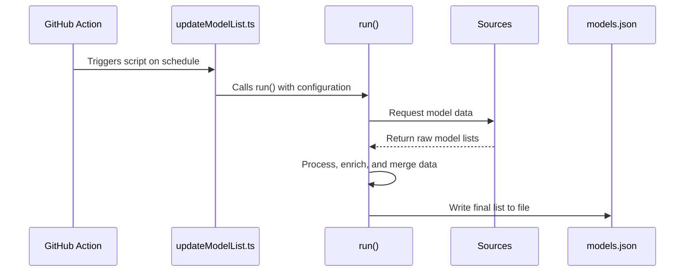

# Chapter 1: Data Processing Pipeline

Building on the foundational setup covered in [Getting Started](getting-started-929492837.md), where we installed and explored the basics of the project, this chapter delves into the automated machinery that keeps our model repository current.

Welcome to the HAWKI Model Repository! This project's main goal is to collect information about various AI models from all over the internet and present it in a single, organized format.

But how do we automatically keep this list fresh and up-to-date? Imagine you are a librarian tasked with creating a catalog of every new book released by dozens of different publishers. Doing this manually every day would be impossible! You would want an automated system that fetches the new book lists, merges them, and updates your master catalog.

This is exactly the problem our **Data Processing Pipeline** solves. It's an automated workflow that acts as our "librarian," keeping our central model list, `models.json`, accurate and current.

### What is the Pipeline?

Unlike a traditional web server that's always on and waiting for user requests, our backend is a script that runs on a schedule. Think of it like a delivery truck that makes its rounds twice a day to pick up new goods. This "truck" is a GitHub Action, a built-in automation tool in GitHub, that kicks off our process.

The pipeline's job can be broken down into three simple stages:

1.  **Fetch:** It visits various online sources to get the latest information on AI models.
2.  **Process:** It takes this raw data, cleans it up, and enriches it with more details, like translating descriptions or calculating prices.
3.  **Store:** It saves the final, polished list of models into a single file named `models.json`.

This entire workflow is designed to be a "pipeline," where data flows in one end, is transformed through several steps, and comes out the other end as a finished product.

### The Starting Point: `updateModelList.ts`

Every process needs a starting point. For our pipeline, it's the `updateModelList.ts` script. This file is like the ignition key for our entire operation. Its main job is to call the `run` function, which coordinates the whole pipeline.

Let's look at a simplified version of how it starts the process:

```typescript
// .github/.generate/src/updateModelList.ts

// Import the function that runs the pipeline
import {run} from 'src/processing/run.js';

// ... other imports for sources and secrets ...

// Call the 'run' function with all our settings
run({
  // 1. Tell it where to get model data from
  sources: [
    modelsDevSource,
    openRouterSource
  ],

  // 2. Tell it where to save the final file
  storageFilePath: 'models.json', // Simplified path

  // 3. Provide the secret keys needed for the sources
  secrets: {
    openRouterKey: "...",
    deepLKey: "...",
    openAiKey: "..."
  }
});
```

Here's what this configuration does:
*   `sources`: This is a list of all the places we will fetch model data from. We'll explore these in detail in the [Model Data Sources](model-data-sources-1211143.md) chapter.
*   `storageFilePath`: This tells the pipeline where to save the final `models.json` file.
*   `secrets`: To access some data sources, we need special "keys" or passwords. This is where we provide them securely.

### Under the Hood: A Step-by-Step Flow

When the `run` function is called, it kicks off a chain of events. Let's visualize what happens from start to finish.



As you can see, the process is linear and straightforward:
1.  A **GitHub Action** (our alarm clock) starts the `updateModelList.ts` script.
2.  The script calls the `run()` function.
3.  `run()` reaches out to all the specified **Data Sources**.
4.  It then processes all the data it received.
5.  Finally, it writes the beautiful, consolidated data to the `models.json` file.

### A Deeper Dive into the `run` function

The `run` function in `run.ts` is the main conductor of our orchestra. It directs each part of the pipeline in the correct order. Let's look at its three main responsibilities.

**1. Fetching Data from Sources**

First, it loops through every source we gave it and collects all the raw model data.

```typescript
// .github/.generate/src/processing/run.ts

// An array to hold all models from all sources
const allModels: ModelInformation[] = [];

// Loop through each source provided in the options
for (const source of options.sources) {
  // Ask the source to fetch its models
  const models = await source(options);
  // Add the new models to our main list
  allModels.push(...models);
}
```

This part is like sending out scouts to different locations to gather intelligence. Once they all report back, we have a complete (but still raw) picture.

**2. Sending Data for Processing**

Next, `run` hands off the raw list to the `processor` function. This function is the heart of the pipeline, where all the "magic" happens.

```typescript
// .github/.generate/src/processing/run.ts

// Send the combined model list to the processor
const processedStorage = await processor(
  modelsFiltered, // The list of models to process
  storage,        // The existing data from models.json
  hashes,         // A file to track changes
  {
    // A list of steps to apply to new or changed models
    newAndChanged: [ ... ],
    // A list of steps to apply to all models at once
    batch: [ ... ]
  },
  options
);
```

The `processor` is incredibly smart. It compares the newly fetched models with our existing `models.json` file. It figures out which models are brand new, which ones have been updated, and which ones are no longer available. It then applies a series of enhancement steps, which we'll cover in the [Pluggable Processing Steps](pluggable-processing-steps-1541383417.md) chapter.

**3. Saving the Final Result**
Once the `processor` is done and returns the final, polished data structure, the `run` function has one last job: save it to disk.

```typescript
// .github/.generate/src/processing/run.ts
import * as fs from 'node:fs';

// Write the beautiful, processed data to our target file
fs.writeFileSync(
  options.storageFilePath,
  JSON.stringify(processedStorage),
  'utf-8'
);
```
This command takes our final data, converts it into a clean JSON string, and saves it as `models.json`, overwriting the old version. The pipeline has now completed its run!

### Conclusion

You've just learned about the most fundamental concept in this project: the **Data Processing Pipeline**.

Here are the key takeaways:
- It's an automated script, not a live server, triggered on a schedule by a GitHub Action.
- It follows a simple **Fetch -> Process -> Store** workflow.
- The `updateModelList.ts` script starts the process by calling the `run` function.
- The `run` function orchestrates the entire flow, using the `processor` to handle the heavy lifting of data comparison and enrichment.
- The final result is a freshly updated `models.json` file, which is the "source of truth" for all model data in our project.

Now that you have a high-level view of the entire pipeline, you're probably curious about where the initial model data comes from. Let's find out! In the next chapter, we will explore the various [Model Data Sources](model-data-sources-1211143.md) that feed our pipeline.

