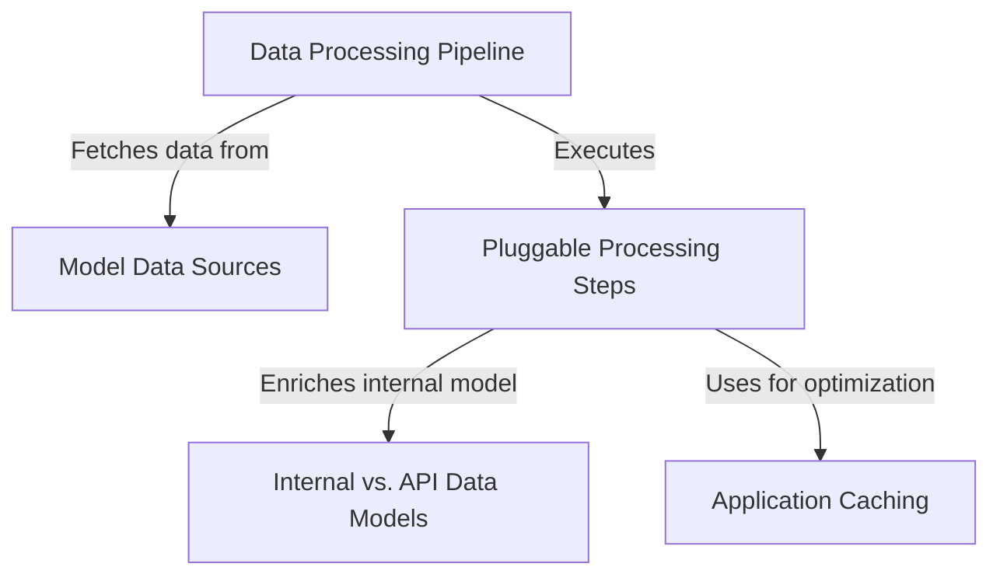

# Tutorial: HAWKI - Model Repository

This project automatically builds a **comprehensive database** of AI models, available in a single `models.json` file. It's not a web server, but a backend script that runs on a schedule using a *GitHub Action*.
The script executes a `Data Processing Pipeline` that *fetches model data* from various external sources. It then enriches this data through a series of *pluggable processing steps*, such as generating summaries with AI, translating descriptions, and converting prices. To improve performance and reduce costs, it uses *caching* for expensive operations. The final, consolidated data is structured according to a clean *API data model*, separate from the more complex internal models used during processing.

**Source Repository:** [git@github.com:hawk-digital-environments/hawki-model-repository.git](git@github.com:hawk-digital-environments/hawki-model-repository.git)

## Chapters

1. [Getting Started](getting-started-929492837.md)
1. [Data Processing Pipeline](data-processing-pipeline-1338362951.md)
1. [Model Data Sources](model-data-sources-1211143.md)
1. [Pluggable Processing Steps](pluggable-processing-steps-1541383417.md)
1. [Internal vs. API Data Models](internal-vs-api-data-models-1708060760.md)
1. [Application Caching](application-caching-294214481.md)

