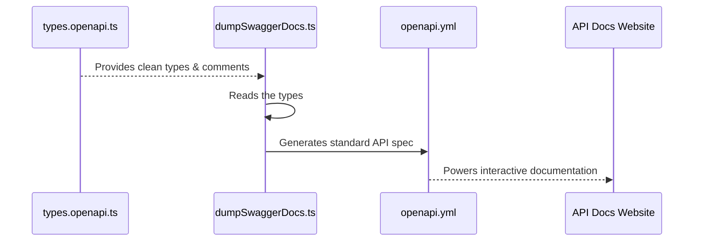

# Chapter 4: Internal vs. API Data Models

In the previous chapter on [Pluggable Processing Steps](pluggable-processing-steps-1541383417.md), we saw how our pipeline turns raw model data into a fully enriched, detailed list. At the end of that process, we have all the information we need.

But this raises an important question: Is the data format we use *inside* our pipeline the best format to show to the *public*? Imagine a chef's kitchen. It's full of measuring cups, partially mixed ingredients, and scribbled notes—everything needed to cook. But when the dish is served, you don't see all that. You get a beautifully plated meal.

This is exactly why we distinguish between **Internal Data Models** and **API Data Models**.

-   **Internal Models:** Our "chef's kitchen." These are complex, detailed data structures designed for the flexibility and power needed during our data processing.
-   **API Models:** Our "restaurant menu." These define the clean, simple, and stable data structure that end-users will find in the final `models.json` file.

This separation lets us have a messy, complex kitchen behind the scenes while still presenting a clean, reliable, and easy-to-use menu to our customers.

### The Internal Model: Built for Processing

Our internal model is called `ProcessedModelInformation`. It's the result of all the hard work done by our [Pluggable Processing Steps](pluggable-processing-steps-1541383417.md). Its structure is optimized for our internal logic.

For example, look at how it handles pricing. During processing, we run currency conversions. The `ProcessedModelInformation` holds the results in a flexible structure that's easy for our code to work with.

```typescript
// .github/.generate/src/types.ts (Simplified)

export interface ProcessedModelInformation {
  // ... other fields
  providers: ProcessedModelProviderInformation[];
}

export interface ProcessedModelProviderInformation {
  // ... other provider fields
  price: Record<string, { // A flexible "dictionary" of currencies
    currency: string;
    input?: string;
    output?: string;
  }>;
}
```

This structure is perfect for our pipeline. A processing step can easily add a new currency (like `JPY` or `CAD`) to the `price` object without needing to change the model's fundamental shape. It's built for flexibility.

### The API Model: Built for Consumers

The public doesn't need all that internal complexity. They need a stable "contract." They want to know that `models.json` will have a predictable structure that won't suddenly change just because we improved our internal currency conversion logic.

This is the job of our API models, defined in `types.openapi.ts`. These types define the public "shape" of our `models.json` file.

```typescript
// .github/.generate/src/types.openapi.ts (Simplified)

/**
 * The information about a single AI model in the API response.
 */
interface Model extends ProcessedModelInformation {
  /**
   * The list of providers that offer this model.
   */
  providers: ProviderOfModel[];
  // ... any subtle differences or just clearer documentation
}
```

You might notice that `Model` looks very similar to `ProcessedModelInformation`. You're right! In many cases, the structure is nearly identical. The key difference is the **intent**:

1.  **Stability:** The API model acts as a protective shield. We can add temporary fields or change things in `ProcessedModelInformation` for a new processing step. As long as we ensure the final output still matches the `Model` API type, we won't break anything for our users.
2.  **Documentation:** This is the most important part. The `types.openapi.ts` file is full of user-friendly comments (like `/** ... */`). These comments are not for us developers; they are for the end-users.

### Generating The Public API Documentation

This separation becomes incredibly powerful when we automatically generate our API documentation. We have a script, `dumpSwaggerDocs.ts`, that does one thing: it reads the API model types from `types.openapi.ts` and their comments, and turns them into a professional documentation file called `openapi.yml`.

This file format (OpenAPI, formerly Swagger) is the industry standard for REST APIs. It can be used to generate an interactive website where users can explore the API, see all the fields, and read our carefully written descriptions.

The process looks like this:



The script itself is quite straightforward. It uses a library called `ts-oas` to perform the magic.

```typescript
// .github/.generate/src/dumpSwaggerDocs.ts (Simplified)

import {createProgram, TsOAS} from 'ts-oas';

// 1. Tell the tool where our API types are
const tsProgram = createProgram(['src/types.openapi.ts'], { /* config */ });

// 2. Initialize the OpenAPI generator
const tsoas = new TsOAS(tsProgram);

// 3. Generate the specification based on our 'GetModelsAPI' type
const specObject = tsoas.getOpenApiSpec([/GetModelsAPI/]);

// 4. Save the result to a file
fs.writeFileSync('openapi.yml', stringify(specObject));
```

Because of this separation, our internal `types.ts` can have messy, developer-only comments. But `types.openapi.ts` is kept pristine, because it's the source of truth for our public-facing documentation.

### Conclusion

You've now learned about the important separation between what we use internally and what we expose to the world.

Here are the key takeaways:
-   **Internal Models** (`ProcessedModelInformation`) are designed for the flexibility and complexity of our data processing pipeline.
-   **API Models** (`types.openapi.ts`) are designed for public consumption, prioritizing stability, clarity, and documentation.
-   This separation allows our internal code to evolve freely without breaking things for people who use `models.json`.
-   The API Models are used by a script (`dumpSwaggerDocs.ts`) to automatically generate our official, user-friendly API documentation.

Our pipeline is now complete. It fetches, processes, and stores a final `models.json` file in a well-defined format. But running all these steps, especially API calls for descriptions and translations, can be slow and costly. Do we really need to do it all every single time?

In the next chapter, we’ll see how we make our pipeline smart and efficient with [Application Caching](application-caching-294214481.md).

