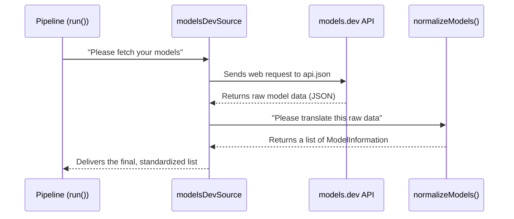

# Chapter 2: Model Data Sources

In the [previous chapter](data-processing-pipeline-1338362951.md), we looked at the entire **Data Processing Pipeline**, our automated system for collecting model information. We learned that the very first step in this pipeline is "Fetch." But what exactly does that mean? Where do we fetch the data from?

Let's use an analogy. Imagine you're a news reporter writing an article. You can't just get your story from one person; you need to talk to multiple sources to get a complete picture. Each source (an eyewitness, a police officer, an official report) gives you information in a different way. Your job is to gather all these disparate pieces of information and combine them into a single, coherent story.

This is exactly what **Model Data Sources** do for our project. They are our "reporters" on the ground, each responsible for fetching model data from a specific online API, like OpenRouter or models.dev.

### The "Universal Adapter" Problem

Every API that lists AI models has its own unique format.
*   **OpenRouter** might call a model's context window `context_length`.
*   **models.dev** might call it `limit.context`.
*   One might provide prices per token, another per million tokens.

If our main processing logic had to understand every single one of these variations, it would become incredibly complex and fragile. Every time we added a new source, we'd have to rewrite our core code.

Model Data Sources solve this problem by acting as **universal adapters**. Each source is a self-contained module that knows how to do three things:
1.  **Fetch**: Talk to a specific external API.
2.  **Validate**: Make sure the data received is in the expected format.
3.  **Normalize**: Translate the API's unique format into our single, standard structure.

This design is incredibly powerful. It means our main pipeline doesn't need to know anything about the outside world except that it will receive data in one consistent format.

### The Contract: `ModelInformationSource`

To ensure every "adapter" works the same way, they must all follow a contract. In our codebase, this contract is a TypeScript type called `ModelInformationSource`.

```typescript
// .github/.generate/src/sources/types.ts

// A function that gets model data and returns it in our standard format
export type ModelInformationSource =
  (options: RunOptions) => Promise<ModelInformation[]>;
```

This might look a bit abstract, so let's break it down. It simply says: "A `ModelInformationSource` is a function that, when called, will eventually give you back a list of models, all perfectly formatted."

This contract lets us plug different sources into our pipeline interchangeably, just like plugging different appliances into a standard wall socket.

### The Standard Format: `ModelInformation`

So what is this "perfectly formatted" structure that all sources produce? It's defined by the `ModelInformation` interface. This is our project's "source of truth" for what a model looks like.

Let's look at a simplified version of its structure:

```typescript
// .github/.generate/src/sources/types.ts

// Our standard format for a single model
export interface ModelInformation {
  id: string;          // A unique, clean ID like "claude-3-opus"
  name: string;        // A nice name like "Claude 3 Opus"
  description: string; // A description of the model
  providers: ModelInformationOfProvider[]; // A list of places you can get this model
  // ... and many more details!
}
```

No matter where the data comes from, by the time a data source is done with it, every model will be neatly packed into one of these `ModelInformation` objects.

### A Look Inside a Data Source: `modelsDevSource`

Let's peek inside one of our data sources to see how it works. We'll use `modelsDevSource`, which fetches data from `models.dev`.

The entire process follows a clear, step-by-step flow.



As you can see, the data source acts as a middleman, fetching raw data and then passing it to a helper function to do the translation.

Let's see how this looks in the code.

#### Step 1: The Main Function

The `modelsDevSource` is an `async` function that orchestrates the work. It calls helper functions to fetch and then normalize the data.

```typescript
// .github/.generate/src/sources/modelsDev/modelsDevSource.ts

export const modelsDevSource: ModelInformationSource = async () => {
  // 1. Get the raw data from the models.dev API
  const fetchedModels = await fetchModels();

  // 2. Clean up and translate the raw data
  const normalizedModels = normalizeModels(fetchedModels);

  // 3. Merge any duplicate entries
  return deduplicateModels(normalizedModels);
};
```
This is the entry point that our pipeline calls. It's simple and readable because it delegates the hard work to other functions.

#### Step 2: Fetching the Raw Data

The `fetchModels` function is responsible for the "F" in "Fetch". It uses a library called `axios` to make a web request to the `models.dev` API endpoint.

```typescript
// .github/.generate/src/sources/modelsDev/modelsDevSource.ts

async function fetchModels(): Promise<ModelsDevModel[]> {
  try {
    // Contact the models.dev server and ask for its data
    const response = await axios.get('https://models.dev/api.json');
    // ... validation and initial parsing logic ...
    return theParsedData;
  } catch (e) {
    throw new Error(`Failed to fetch models: ${e}`);
  }
}
```
This function's only job is to get the data from the internet. It doesn't care what the data means yet.

#### Step 3: Normalizing the Data

This is where the magic happens. The `normalizeModels` function takes the raw, messy data from the API and carefully maps it into our clean `ModelInformation` structure.

```typescript
// .github/.generate/src/sources/modelsDev/modelsDevSource.ts

function normalizeModels(models: ModelsDevModel[]): ModelInformation[] {
  return models.map(rawModel => {
    // Create a standard ModelInformation object for each raw model
    const info: ModelInformation = {
      id: getModelBaseId(rawModel.id), // "openai/gpt-4" -> "gpt-4"
      name: rawModel.name,
      description: '', // We'll add this later
      input: rawModel.modalities.input,
      output: rawModel.modalities.output,
      // ... more mapping ...
      providers: [ /* provider-specific details go here */ ]
    };
    return info;
  });
}
```

Notice how it takes properties from the `rawModel` (like `rawModel.name`) and assigns them to the fields in our standard `info` object (like `name`). This is the "translation" process in action!

### Handling Duplicates

What happens when both `openRouterSource` and `modelsDevSource` report information about the same model, like "Llama 3"? We don't want two separate entries in our final `models.json` file.

That's the job of the `deduplicateModels` function. After a source has normalized its data, it runs this final step. This function intelligently finds models with the same ID and merges them into a single entry, combining information from all providers.

For example, if `models.dev` says Llama 3 is provided by Groq, and `openRouter` says it's also available on OpenRouter, the final merged entry will list *both* Groq and OpenRouter in its `providers` list.

### Conclusion

You now understand the crucial role of **Model Data Sources**. They are the foundation of our pipeline, responsible for talking to the outside world and translating everything into a language our system can understand.

Key takeaways:
-   **Data Sources are Adapters:** They fetch, validate, and normalize data from external APIs.
-   **A Universal Contract:** Every source follows the `ModelInformationSource` contract, making them pluggable and easy to manage.
-   **A Standardized Format:** They all output data in the `ModelInformation` structure, creating consistency for the rest of the pipeline.
-   **Modularity is Key:** This design makes it simple to add a new API provider without changing any of the core logic. Just create a new "adapter" file!

We've successfully fetched a clean, standardized list of models. But this data is still basic. It might be missing descriptions, have pricing in different currencies, or lack other important details. How do we enrich this data?

In the next chapter, we'll explore the assembly line that processes this normalized data: [Pluggable Processing Steps](pluggable-processing-steps-1541383417.md).

