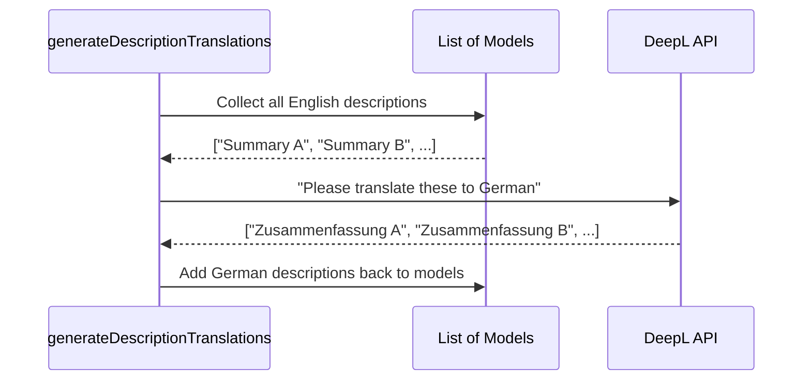

# Chapter 3: Pluggable Processing Steps

In the [previous chapter on Model Data Sources](model-data-sources-1211143.md), we learned how our pipeline fetches data from various APIs and translates it into a single, standard format. We now have a clean list of models, but it's still quite basic.

For example, a model's description might be missing, or its pricing might only be available in US Dollars. To be truly useful, our data needs to be enriched. How do we take this raw-but-clean data and make it shine?

This is where our data enrichment engine comes in: the **Pluggable Processing Steps**.

### The Assembly Line for Data

Imagine you're manufacturing a toy car. The raw material—a simple plastic mold—is just the beginning. The mold has to move down an assembly line.
-   **Station 1** adds the wheels.
-   **Station 2** paints the body.
-   **Station 3** adds the racing stripes.
-   **Station 4** puts it in a box.

Each station performs one small, specific job. Our data pipeline works the same way. The normalized `ModelInformation` object is our "plastic mold." It's sent down an assembly line of **Processing Steps**, where each step adds a new piece of information or transforms an existing one.

This "plug-and-play" design is the core of our system's flexibility. Need to add support for a new currency? Just add a new "station" to the assembly line. You don't need to change any of the other stations!

### The Assembly Line Manager: The `processor`

The function that manages this whole assembly line is the `processor`. As we saw in [Chapter 1](data-processing-pipeline-1338362951.md), the main `run` function hands off all the model data to the `processor` and tells it which "assembly lines" (lists of steps) to use.

```typescript
// .github/.generate/src/processing/run.ts (Simplified)

// Send the models to the processor with our steps
const processedStorage = await processor(
  modelsList,
  // ... other data
  {
    // A list of steps for new or changed models
    newAndChanged: [ ... ],
    // A list of steps to apply to all models at once
    batch: [ ... ]
  },
  // ...
);
```

The `processor` is smart. It compares the newly fetched models against the ones we already have.
-   If a model is brand new or has been updated, it gets sent down the `newAndChanged` assembly line.
-   After all individual models are processed, the entire group is sent to the `batch` assembly line for group-based tasks.

Let's look at these two main types of steps.

### Type 1: The Per-Model Assembly Line (`newAndChanged`)

This is the most common type of step. It runs once for every single model that is new or has changed. Each step takes a model, performs a transformation, and passes it to the next step.

A great example is generating a description for a model. Our goal: ensure every model has a high-quality English description.

Let's look at the `generateDescription` step. Its job is to find a description, or create one if it can't be found.

Every step in the `newAndChanged` list follows a contract called `ProcessingStep`:

```typescript
// .github/.generate/src/processing/steps/types.ts

export type ProcessingStep = (
  sourceModel: ModelInformation,
  existingModel: ProcessedModelInformation | undefined,
  newModel: ProcessedModelInformation,
  // ... other options
) => Promise<ProcessedModelInformation>;
```

This says: "A `ProcessingStep` is a function that receives the raw source data, the old version of the model (if it exists), and the model we are currently building (`newModel`). It must return the `newModel` after modifying it."

Here’s a simplified look at how `generateDescription` works:

```typescript
// .github/.generate/src/processing/steps/generateDescription.ts

export const generateDescription: ProcessingStep = async (
  sourceModel,
  existingModel,
  newModel,
  // ...
) => {
  // 1. Try to use the description from the source API.
  let description = sourceModel.description;

  // 2. If it's empty, try to use the one from our last run.
  if (!description) {
    description = existingModel?.description?.en;
  }

  // 3. If it's STILL empty, ask an AI to write one.
  if (!description) {
    description = await generateAiDescription(sourceModel, ...);
  }

  // 4. Attach the final description to the model.
  newModel.description = { en: description };
  return newModel;
};
```
This step is a perfect example of a focused, single-responsibility "station." It doesn't care about pricing or translations; its only job is to ensure a description exists.

Another example is `generateInitialPricing`. It takes the price from the source (e.g., in USD) and uses a currency conversion service to calculate the price in our other supported currencies (like EUR or GBP).

### Type 2: The Bulk Processing Line (`batch`)

Some tasks are very inefficient if you do them one by one. Imagine you need to translate 50 model descriptions from English to German. Making 50 separate API calls to a translation service would be slow and expensive. It's much better to send all 50 texts in a single batch.

This is what `batch` steps are for. They run *after* all the individual `newAndChanged` steps are finished.

A batch step gets the *entire list* of processed models and can perform operations on the whole set.

```typescript
// .github/.generate/src/processing/steps/types.ts

export type BatchProcessingStep = (
  models: ProcessedModelInformation[],
  // ... other options
) => Promise<ProcessedModelInformation[]>;
```
The `generateDescriptionTranslations` step is a perfect use case for this. Here’s a high-level view of how it works:



1.  **Collect:** The step first loops through all the models and gathers every English description that needs translating into a single list.
2.  **Translate in Bulk:** It sends this entire list to the DeepL translation API in one request.
3.  **Apply:** Once it gets the translated texts back, it loops through the models again and applies the new German descriptions where they belong.

This approach is far more efficient than translating one description at a time.

### Plugging It All Together

Now that we understand the different types of steps, let's see how they are "plugged in" inside the `run` function. The order is important!

```typescript
// Simplified from .github/.generate/src/processing/run.ts

await processor(
  modelsList,
  {
    newAndChanged: [
      // Step 1: Add pricing info (including currency conversions)
      generateInitialPricing,
      // Step 2: Ensure a description exists
      generateDescription,    
    ],
    batch: [
      // Step 3 (Runs after all models complete 1 & 2):
      // Translate all descriptions at once.
      generateDescriptionTranslations,
    ],
  },
);
```

This configuration defines our entire data enrichment assembly line:
1.  First, for each new/changed model, we calculate its pricing in all currencies.
2.  Then, we generate an English description for it.
3.  Finally, after every model has its pricing and English description, a single batch step runs to translate all those descriptions into other languages.

### Conclusion

You've just learned about the powerful and flexible engine at the heart of our project: **Pluggable Processing Steps**.

Here are the key takeaways:
-   **Processing Steps are small, focused functions** that enrich our model data, like an assembly line for information.
-   This **"plug-and-play" architecture** makes it easy to add new features (like a new currency) without breaking existing logic.
-   Steps are organized into categories:
    -   `newAndChanged` steps run on each model individually.
    -   `batch` steps run on the entire group of models for efficiency.
-   The `processor` function is the manager that directs models through the correct sequence of steps.

We've now gone from fetching raw data to producing a complete, enriched `models.json` file. But the format we use for this internal file isn't necessarily what we want to show to the public. In the next chapter, we'll explore the difference between our internal data and the data we expose via an API in [Internal vs. API Data Models](internal-vs-api-data-models-1708060760.md).

